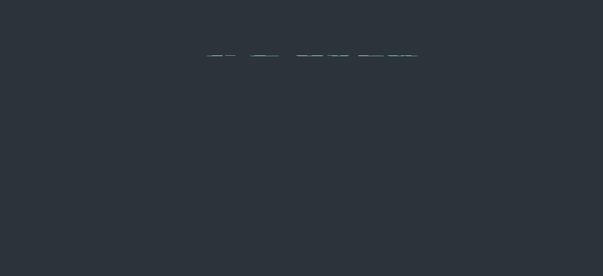

# CSS Animation Snippets

## Example 0

####  HTML CODE

```html

<!DOCTYPE html>
<html >
  <head>
    <meta charset="UTF-8">
    <title>Playing a CSS animation on hover</title>
    <link href="styles.css" type="text/css" media="all" rel="Stylesheet"/>

  </head>

  <body>

    <link href='http://fonts.googleapis.com/css?family=Bree+Serif' rel='stylesheet' type='text/css'>

<div class="wrap">
  <div class="sticker"></div>
  <div class="msg">new!</div>
</div>

  </body>
</html>

```

####  CSS CODE

```css
body {padding:6em; background:#fcfcfc;}

.wrap {width:200px; margin:auto;  z-index:1;}

.msg {
  color: whitesmoke;
  text-align:center;
  font-family: 'Bree Serif', Courier, monospaced;
  font-size:3.5em;
  width:200px;
  position:absolute;
  margin:55px 0 0 2px;
  pointer-events: none;
}

.sticker {
  width:200px;
  height:200px;
  position:absolute;
  background: url(sticker.png) top center no-repeat;
  animation:spin 10s linear infinite;
  animation-play-state:paused;/*It is pasused*/
}

    .sticker:hover {/*Running*/


        animation-play-state:running;
    }


@keyframes spin {

    0%{transform:rotate(0turn);}
    100%{transform:rotate(1turn);}
    /*1turn means it will completly rotate once.*/

}

```

#### Output


## Example 1

####  HTML CODE

```html

<html>
	<head>
		<title>Animation Basics</title>		
		<link rel="stylesheet" href="styles.css" media="all" />
	</head>
	<body>

	<div class="wrapper">
		
	</div>

	</body>
</html>

```

####  CSS CODE

```css
body {
	background-image: url('background.png');
	background-size: cover;
	background-position: 0px -250px;
}

.wrapper {
	margin: 20em auto 2em auto;
	width:80%;
	position:relative;
}

.robot {

  animation-name:slide;
  animation-duration:3s;
  animation-timing-function:ease-in;
  animation-iteration-count:1;/*infinite will not stop*/
  animation-delay:1s;
  animation-fill-mode:forwards;/*The aniamtion-fill-mode is useful to decide how to finish the animation*/
                               /*backwords and both*/
}

@keyframes slide{

	from{transform:translate(0px);}
	to{transform:translate(900px);}


}

```

#### Output


## Example 2

####  HTML CODE

```html
<html>
	<head>
		<title>animation-fill-mode</title>
		<link rel="stylesheet" href="styles.css" media="all" />
	</head>

	<body>		
		
	</body>

</html>
```

####  CSS CODE

```css

body {margin: 4em 10%; background:#493F5B;}

 .ball {
	animation-name: move-left-right;
	animation-duration: 2s;
	animation-timing-function: ease-in;
	animation-iteration-count: 1;
 	animation-delay:1s;
    animation-fill-mode:both;
}

@keyframes move-left-right {
	0% {transform: translateX(100px) rotate(0turn);}
	20% {transform: translateX(-10px) rotate(-0.5turn);}
	100% {transform:translateX(450px) rotate(2turn);}			
}
```

#### Output


## Example 3

####  HTML CODE

```html
<html>
	<head>
		<title>Animation Basics</title>		
		<link rel="stylesheet" href="styles.css" media="all" />
	</head>
	<body>

	<div class="wrapper">
		
	</div>

	</body>
</html>

```

####  CSS CODE

```css
body {
	background-image: url('background.png');
	background-size: cover;
	background-position: 0px -250px;
}

.wrapper {
	margin: 20em auto 2em auto;
	width:80%;
	position:relative;
}

.robot {
	animation-name: slide;
	animation-duration: 2s;
	animation-timing-function: ease-in;
	animation-iteration-count: 1;
	animation-fill-mode:forwards;
    animation-direction:reverse;/*This will run the animation reversly*/
}

@keyframes slide {
	from {transform: translateX(0);}
	to {transform: translateX(900px);}
}
```

#### Output


## Example 4

####  HTML CODE

```html
<html>
	<head>
		<title>Animation Basics</title>		
		<link rel="stylesheet" href="styles.css" media="all" />
	</head>
	<body>

	<div class="wrapper">
		
	</div>

	</body>
</html>
```

####  CSS CODE

```css

body {
	background-image: url('background.png');
	background-size: cover;
	background-position: 0px -250px;
}

.wrapper {
	margin: 20em auto 2em auto;
	width:80%;
	position:relative;
}

.robot {
	animation-name: slide;
	animation-duration: 2s;
	animation-timing-function: ease-in;
	animation-iteration-count: 2;/*We should make to 2*/
	animation-fill-mode:forwards;
    animation-direction:alternate;/*This will move the element in both*/
}

@keyframes slide {
	from {transform: translateX(0);}
	to {transform: translateX(900px);}
}
```

#### Output


## Example 5

####  HTML CODE

```html
<html>
	<head>
		<title>Animation Basics</title>		
		<link rel="stylesheet" href="styles.css" media="all" />
	</head>
	<body>

	<div class="wrapper">
		
	</div>

	</body>
</html>
```

####  CSS CODE

```css
body {
	background-image: url('background.png');
	background-size: cover;
	background-position: 0px -250px;
}

.wrapper {
	margin: 20em auto 2em auto;
	width:80%;
	position:relative;
}

.robot {
	animation-name: slide;
	animation-duration: 2s;
	animation-timing-function: ease-in;
	animation-iteration-count: 2;/*We should make to 2*/
	animation-fill-mode:forwards;
    animation-direction:alternate-reverse;/*This will move the element from reverse to start*/
}

@keyframes slide {
	from {transform: translateX(0);}
	to {transform: translateX(900px);}
}
```

#### Output


## Example 6

####  HTML CODE

```html
<html>
	<head>
		<title>Animation Basics</title>		
		<link rel="stylesheet" href="styles.css" media="all" />
	</head>
	<body>

	<div class="wrapper">
		
	</div>

	</body>
</html>
```

####  CSS CODE

```css
body {
	background-image: url('background.png');
	background-size: cover;
	background-position: 0px -250px;
}

.wrapper {
	margin: 20em auto 2em auto;
	width:80%;
	position:relative;
}

.robot {
	animation-name: slide;
	animation-duration: 3s;
	animation-timing-function: cubic-bezier(.41,.07,.62,.91) ;
	animation-fill-mode:forwards;
	animation-direction: alternate;
	animation-iteration-count: 4;
}

@keyframes slide {
	0%{transform: translateX(0);}
	20% {transform:translateX(200px);}
	35% {transform:translateX(0);}
	90% {transform: translateX(980px);}
	100% {transform: translateX(900px);}
}
```

#### Output


## Example 7

####  HTML CODE

```html
<!DOCTYPE html>
<html>
<head>
	<title>Clouds</title>
	<link rel="stylesheet" href="styles.css" media="all" />

</head>
<body>

<div class="sky">
	<div class="cloud fcloud01"></div>
	<div class="cloud fcloud02"></div>
</div>

</body>
</html>
```

####  CSS CODE

```css
body {
  background:#678bb3;
  padding:0;
  margin:0;
}

.sky {
  width:100%;
  height:1000px;
  background: transparent url(img/sky.jpg) top left no-repeat;
  background-size: 100% 100%;
  margin:auto;
  position:relative;
}

.cloud {
  width: 250px;
  height:200px;
  position:absolute;
  background:transparent url(img/front_cloud.png) 0 0 no-repeat;
}

.fcloud01 {
  top:100px;
  z-index:100;

      animation:drift 25s linear infinite;
      /*Animation name,duration,type of timing function , iteration-count*/
  }

.fcloud02 {
  top:240px;
  z-index: 200;

      animation:drift 45s  linear infinite;
        /*Animation name,duration,delay,type of timing function , iteration-count*/
}

@keyframes drift {

  from{transform:translateX(-255px);}
  to{transform:translateX(1350px);}

}
```

#### Output


## Example 8

####  HTML CODE

```html
<!DOCTYPE html>
<html >
  <head>
    <meta charset="UTF-8">
    <title>Animated entrance</title>
    <link rel="stylesheet" href="styles.css">

  </head>

  <body>

    <section>
    <div class="card">
        <div class="icon-space">
        
      </div>
        <div class="inner">
           <div class="info">
        <h2>Your Reservation is complete!</h2>
          <p>Come meet the robots on Saturday at 2pm. <br/>
           We can't wait to see you there!</p>
          <button>Make another reservation</button>
        </div>

      </div>
    </div>
</section>


  </body>
</html>
```

####  CSS CODE

```css

@import url(http://fonts.googleapis.com/css?family=Roboto+Condensed:400,300|Lato:300,400);

body {
  background: rgb(249, 228, 202);
  font-family: 'Lato', sans-serif;
  line-height: 1.4;
  font-weight: 300;
  margin: 6em 0;
  overflow:hidden;
}

section {
  width: 500px;
  margin: auto;
}

.card {
  background: rgba(255, 255, 255, 0.9);
  font-family: 'Roboto Condensed', sans-serif;
  padding: .5em 2em;
  border-radius: 4px;
  box-shadow: 0px 0px 0px 1px rgba(0, 0, 0, 0.03), 0px 1px 2px 0px rgba(0, 0, 0, 0.05);
  margin: auto;
  width: 430px;
  text-align: center;
}

.inner {
  margin: 1em 0 2em 0;
}

h2 {
  color: #FB5362;
  font-family: 'Roboto Condensed', sans-serif;
  font-size: 40px;
  font-size: 2rem;
  font-weight: 300;
  margin: 0 0 .15em 0;
}

h3 {
  margin: 0 0 .5em 0;
}

p {
  margin: 0;
  color: #666666;
}

.icon-space {
  margin-top: -40px;

}
.icon-space img {
  border-radius: 50%;
  display: block;
  margin: auto;
  border: 4px solid white;
  background: white;
  width: 100px;
  height: 100px;
  box-shadow: 0px 0px 0px 1px rgba(0, 0, 0, 0.03), 0px 1px 2px 0px rgba(0, 0, 0, 0.2);
}

button {
  width: auto;
  height: 40px;
  display: block;
  margin: 2em auto;
  padding: 0 5%;
  border: none;
  border-radius: 4px;
  background-color: #1A9DB4;
  color: whitesmoke;
  font-size: 1em;
  font-family: 'Lato', sans-serif;
  font-weight: 400;
  box-shadow: 0px 0px 0px 1px rgba(0, 0, 0, 0.03), 0px 1px 2px 0px rgba(0, 0, 0, 0.3);
  transition: background-color .3s ease-out;
}
button:hover {
  background-color: #FB5362;
}

section {

    animation:slide_in .8s linear,fade_in .5s ease-in;
    /*If we want to add multiple animations we should use , seperator*/

}

@keyframes slide_in {

    0%{
        transform:translateY(400px);
        animation-timing-function:ease-in
    }
    60%{
        transform:translateY(-50px);
        animation-timing-function:ease-out;
    }
    80%{
        transform:translateY(10px);
        animation-timing-function:ease-in;
    }
    100%{

        transform:translateY(0);
        animation-timing-function:ease-out;
    }

}

@keyframes fade_in {


    from {
    opacity:0;
    }
    to {

    opacity:1;
    }

}
```

#### Output


## Example 9

####  HTML CODE

```html
<!DOCTYPE html>
<html >
  <head>
    <meta charset="UTF-8">
    <title>Animating 3D Transforms</title>
     <link href="styles.css" type="text/css" media="all" rel="Stylesheet"/>

  </head>

  <body>

    <link href='http://fonts.googleapis.com/css?family=Alfa+Slab+One' rel='stylesheet' type='text/css'>

 <div>
  <span>U</span>
  <span>P</span>
  <span>&</span>
  <span>O</span>
  <span>V</span>
  <span>E</span>
  <span>R</span>
  </div>

  </body>
</html>
```

####  CSS CODE

```css
body {
  font-family: 'Alfa Slab One', cursive;
  font-size:6rem;
  background:#2c333a;
}

div {
  width:80%;
  margin:4rem auto;
  text-align:center;
  perspective: 800px;
 }

span {
   display:inline-block;
   margin-left: -20px;
   color:#77c6bc;
   transform-origin:50% 70%;
}


span:nth-child(2n) {
  color:#95b8cb;
}

span:nth-child(1) {

    animation:filp-Up 1s cubic-bezier(0.68, -0.55, 0.26, 1.55) both;
}

span:nth-child(2) {
  margin-right:30px;
   animation:filp-Up 1s cubic-bezier(0.68, -0.55, 0.26, 1.55) 0.2s both;
}

span:nth-child(3) {
 margin-right:30px;
  animation:filp-Up 1s cubic-bezier(0.68, -0.55, 0.26, 1.55) 0.4s both;
}

span:nth-child(4) {
     animation:filp-Up 1s cubic-bezier(0.68, -0.55, 0.26, 1.55) 0.6s both;
}

span:nth-child(5) {
  margin-left:-28px;
   animation:filp-Up 1s cubic-bezier(0.68, -0.55, 0.26, 1.55) 0.8s both;
 }

span:nth-child(6) {
     animation:filp-Up 1s cubic-bezier(0.68, -0.55, 0.26, 1.55) 1s both;
}

span:nth-child(7) {
     animation:filp-Up 1s cubic-bezier(0.68, -0.55, 0.26, 1.55) 1.2s both;
}

@keyframes filp-Up {

    0%{transform:rotateX(90deg);}
    100%{transform:rotateX(0deg);}
}
```

#### Output


## Example 10

####  HTML CODE

```html
<!DOCTYPE html>
<html >
  <head>
    <meta charset="UTF-8">
    <title>Animating 3D Transforms</title>
     <link href="styles.css" type="text/css" media="all" rel="Stylesheet"/>

  </head>

  <body>

    <link href='http://fonts.googleapis.com/css?family=Alfa+Slab+One' rel='stylesheet' type='text/css'>

 <div>
  <span>U</span>
  <span>P</span>
  <span>&</span>
  <span>O</span>
  <span>V</span>
  <span>E</span>
  <span>R</span>
  </div>

  </body>
</html>
```

####  CSS CODE

```css
body {
  font-family: 'Alfa Slab One', cursive;
  font-size:6rem;
  background:#2c333a;
}

div {
  width:80%;
  margin:4rem auto;
  text-align:center;
  perspective: 800px;
 }

span {
   display:inline-block;
   margin-left: -20px;
   color:#77c6bc;
   transform-origin: 50% 70%;
}


span:nth-child(2n) {
  color:#95b8cb;
}

span:nth-child(1) {
  animation: flipUp 1s cubic-bezier(0.68, -0.55, 0.26, 1.55) both,
             flipDown .5s cubic-bezier(0.45, 0.03, 0.51, 0.95) 2s forwards,
             swing 4s cubic-bezier(0.45, 0.03, 0.51, 0.95) forwards 4.1s;
}

span:nth-child(2) {
  margin-right:30px;
  animation: flipUp 1s cubic-bezier(0.68, -0.55, 0.26, 1.55) .2s both,
             flipDown .5s cubic-bezier(0.45, 0.03, 0.51, 0.95) 2.2s forwards,
             swing 4s cubic-bezier(0.45, 0.03, 0.51, 0.95) forwards 3.8s;
}

span:nth-child(3) {
 margin-right:30px;
 animation: flipUp 1s cubic-bezier(0.68, -0.55, 0.26, 1.55) .4s both,
            flipDown .5s cubic-bezier(0.45, 0.03, 0.51, 0.95) 2.4s forwards,
            swing 4s cubic-bezier(0.45, 0.03, 0.51, 0.95) forwards 4.4s;
}

span:nth-child(4) {
 animation: flipUp 1s cubic-bezier(0.68, -0.55, 0.26, 1.55) .6s both,
            flipDown .5s cubic-bezier(0.45, 0.03, 0.51, 0.95) 2.6s forwards,
            swing 4s cubic-bezier(0.45, 0.03, 0.51, 0.95) forwards 4.8s;
}

span:nth-child(5) {
  margin-left:-28px;
  animation: flipUp 1s cubic-bezier(0.68, -0.55, 0.26, 1.55) .8s both,
            flipDown .5s cubic-bezier(0.45, 0.03, 0.51, 0.95) 2.8s forwards,
            swing 4s cubic-bezier(0.45, 0.03, 0.51, 0.95) forwards 4.6s;
 }

span:nth-child(6) {
  animation: flipUp 1s cubic-bezier(0.68, -0.55, 0.26, 1.55) 1s both,
            flipDown .5s cubic-bezier(0.45, 0.03, 0.51, 0.95) 3s forwards,
            swing 4s cubic-bezier(0.45, 0.03, 0.51, 0.95) forwards 5s;
}

span:nth-child(7) {
  animation: flipUp 1s cubic-bezier(0.68, -0.55, 0.26, 1.55) 1.2s both,
             flipDown .5s cubic-bezier(0.45, 0.03, 0.51, 0.95) 3.2s forwards,
             swing 4s cubic-bezier(0.45, 0.03, 0.51, 0.95) forwards 4s;

}

@keyframes flipUp {
  from {transform: rotateX(90deg);}
  to {tranform: rotateX(0deg);}
}


@keyframes flipDown {
  to {transform: rotateX(-180deg);}
}


@keyframes swing {
  0% {
     transform: rotateX(-180deg);
  }

  20% {
    transform: rotateX(-180deg) rotateY(-45deg);
  }

  40% {
    transform: rotateX(-180deg) rotateY(45deg);
  }

  60% {
    transform: rotateX(-180deg) rotateY(-45deg);
  }

  80% {
    transform: rotateX(-180deg) rotateY(45deg);
  }

  100% {
    transform: rotateX(-180deg);
  }
}
```

#### Output


