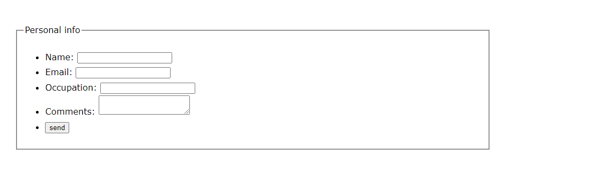

## 01. Attribute Selectors 1

Matches elements when the specified attribute is present. Variations on syntax allow you to target specific attribute values and include options for matching specific string values. While it’s not necessary to preface the attribute value with a simple selector, doing so allows you to match specific element types with attribute values.

### Syntax

Attributes are surrounded by left and right brackets ([ * ]). To target any element with a class attribute, for example, you would use [class]. To be more specific, you can add a element selector prior to the attribute with no whitespace. The selector div[class] would match any div elements with a class attribute, regardless of the value of the attribute.

```css
[class] {
  color: red;
    }

div[class] {
  color: red;
    }
```

### Example:

Basic attribute selector syntax allows you to target elements based on the presence of an attribute, regardless of the value.

## 02. Attribute Selectors 2

Matches elements when the specified attribute is present. Variations on syntax allow you to target specific attribute values and include options for matching specific string values. While it’s not necessary to preface the attribute value with a simple selector, doing so allows you to match specific element types with attribute values.

### Syntax

To match specific values you can modify the syntax to also include the value itself. To match an exact value you simple add the assignment operator (the equals sign) followed by the desired value. As in HTML syntax, the value should be in quotation marks. It’s important to note that this syntax will only return a match if the attribute value is an exact match. The selector p[class=”tip”] would match <p class=”tip”> but not <class=”tip clear”>. To allow for space separated values add a tilde (~) character prior to the equals sign. The selector p[class~=”tip”] would return a match in both of the previous examples.

```css
[class="tip"] {
  color: red;
    }

[class~="tip"] {
  color: red;
    }
```

### Example:

Basic attribute selector syntax allows you to target elements based on the presence of an attribute, regardless of the value.

## 03. Attribute Selectors 3

Matches elements when the specified attribute is present. Variations on syntax allow you to target specific attribute values and include options for matching specific string values. While it’s not necessary to preface the attribute value with a simple selector, doing so allows you to match specific element types with attribute values.

### Syntax

Attribute selectors can also match partial string values inside attributes. By preceding the equals (=) sign with a caret (^) you’ll match the attribute whose value is prefixed by the string. So the selector a[href^="http://"] would match any link with an href value that began with the http protocol. To target a suffix value, you would add a dollar sign ($) prior to the equals (=) sign. In that case the selector a[href$=".pdf"] would match any link with an href attribute ending in “.pdf”. To match a string anywhere in an attribute, you would add an asterisk ( * ) prior to the equals (=) sign. In that case the selector p[class*="book"] would match any paragraph that contains and attribute with “book” anywhere in its value, returning matches for “book”, “bookkeeper”, “new-book”, and “books”.

```css
matching prefix:
a[href^="http://"] {
  color: red;
    }

matching suffix:
a[href$=".pdf"] {
  color: red;
    }

matching partial string:
p[class*="book"] {
  color: red;
    }
```

### Example:

Basic attribute selector syntax allows you to target elements based on the presence of an attribute, regardless of the value.

## 04. Targeting Link States

CSS can target link states by using the :link, :visited, :hover, and :active pseudo-class selectors. These will target any unvisited link with an href attribute, any visited link, any link currently being hovered over, and any link that is currently being interacted with. If used in combination it is recommended to use them in this order, as they share the same level of specificity and :link or :visited styling could overwrite :hover or :active styling. Due to privacy concerns there are limits on the styles you can apply to visited links. For the most part you are limited to color, background-color, and border properties.

### Syntax

To target link states start with the anchor element selector (a) follow it with a colon(:) and then the desired state (link, visited, hover, or active) with no whitespace. The :link pseudo-class selector doesn’t require the anchor element preceding it, although it there’s no real reason to leave it off. The :hover and :active pseudo-class selectors are not exclusive to anchor elements.

```css
unvisted link
a:link {
  color: red;
    }

visited link
a:visited {
  color: gray;
    }

hovered link
a:hover {
  color: black;
    }   

active link
a:hover {
  border: 1px solid red;
    }
```

## 05. Defining Focus

Matches an element when that element accepts focus from the user. Can be element-specific, or styled globally if no element is defined. A common technique in CSS resets is to set the outline property of all elements to 0 using focus, thereby eliminating the user agent’s default outline around focused elements. This practice is harmful to usability. If default outline styling is removed, it should be replaced with an equally noticeable style, as some users rely on this styling for interaction.

### Syntax

To write a focus selector that is element specific, start with the desired element (which can contain class, IDs, or even attribute selectors), and follow that with a colon (:) and then focus, with no whitespace. The selector :focus would apply to all elements.

```css
input:focus {
  border: 1px solid red;
    }
```

### Example:

The focus selector is available for any element that can accept user focus. Traditionally that has been limited to links and other UI elements, but HTML5 allows us to broaden element types.



## 06. Targeting Form Element States

Certain form elements exist in a checked, enabled or disabled state. The :checked, :enabled, and :disabled pseudo-class selectors allow you to style form elements based on their current state. Although there are a number of elements that allow for a disabled state, currently browsers restrict styling to just form elements.

### Syntax

The :checked, :enabled, and :disabled pseudo-class selectors can be written alone to apply to all checked, enabled, or disabled elements, or can be made element-specific by starting with the desired element (which can contain class, IDs, or even attribute selectors), followed with a colon (:) and then :checked, enabled, or disabled, with no whitespace.

```css
input:checked {
  border: 1px solid red;
    }  

input:enabled {
  border: 1px solid red;
    }    

input:disabled {
  border: 1px solid gray;
    }
```

### Example:


## 07. Targeting Fragment Identifiers

Matches an element when that element has an ID attribute that matches the fragment identifier in the URL of the document. For example, if an element had an ID attribute value of “FAQ” and the current URL was “http://site.com/resources#FAQ” then the :target pseudo-class selector could be used to style the targeted region or element. The selector is also backwards-compatible with the deprecated “name” attribute, and will return a match for it as well.

### Syntax

The :target pseudo-class selector can be written alone to apply to all targeted elements, or can be made element-specific by starting with the desired element (which can contain class, IDs, or even attribute selectors), followed with a colon (:) and then “target”, with no whitespace.

```css
:target {
  border: 1px solid red;
    }    

h1:target {
  border: 1px solid red;
    }
```

### Example:

#### Section One
You argue like an informer, Socrates. Do you mean, for example, that he who is mistaken about the sick is a physician in that he is mistaken? or that he who errs in arithmetic or grammar is an arithmetician or grammarian at the me when he is making the mistake, in respect of the mistake? True, we say that the physician or arithmetician or grammarian has made a mistake, but this is only a way of speaking; for the fact is that neither the grammarian nor any other person of skill ever makes a mistake in so far as he is what his name implies; they none of them err unless their skill fails them, and then they cease to be skilled artists. No artist or sage or ruler errs at the time when he is what his name implies; though he is commonly said to err, and I adopted the common mode of speaking. But to be perfectly accurate, since you are such a lover of accuracy, we should say that the ruler, in so far as he is the ruler, is unerring, and, being unerring, always commands that which is for his own interest; and the subject is required to execute his commands; and therefore, as I said at first and now repeat, justice is the interest of the stronger.

#### Section Two
Well then, proceed with your answers, and let me have the remainder of my repast. For we have already shown that the just are clearly wiser and better and abler than the unjust, and that the unjust are incapable of common action; nay ing at more, that to speak as we did of men who are evil acting at any time vigorously together, is not strictly true, for if they had been perfectly evil, they would have laid hands upon one another; but it is evident that there must have been some remnant of justice in them, which enabled them to combine; if there had not been they would have injured one another as well as their victims; they were but half --villains in their enterprises; for had they been whole villains, and utterly unjust, they would have been utterly incapable of action. That, as I believe, is the truth of the matter, and not what you said at first. But whether the just have a better and happier life than the unjust is a further question which we also proposed to consider. I think that they have, and for the reasons which to have given; but still I should like to examine further, for no light matter is at stake, nothing less than the rule of human life.

#### Section Three
They say that to do injustice is, by nature, good; to suffer injustice, evil; but that the evil is greater than the good. And so when men have both done and suffered injustice and have had experience of both, not being able to avoid the one and obtain the other, they think that they had better agree among themselves to have neither; hence there arise laws and mutual covenants; and that which is ordained by law is termed by them lawful and just. This they affirm to be the origin and nature of justice; --it is a mean or compromise, between the best of all, which is to do injustice and not be punished, and the worst of all, which is to suffer injustice without the power of retaliation; and justice, being at a middle point between the two, is tolerated not as a good, but as the lesser evil, and honoured by reason of the inability of men to do injustice. For no man who is worthy to be called a man would ever submit to such an agreement if he were able to resist; he would be mad if he did. Such is the received account, Socrates, of the nature and origin of justice.
