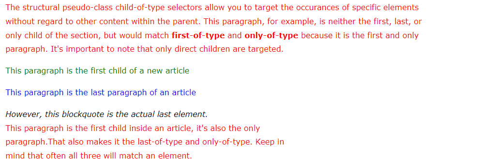
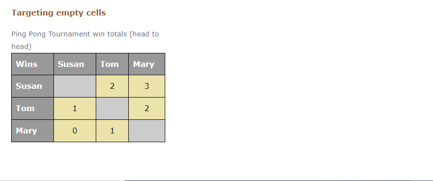
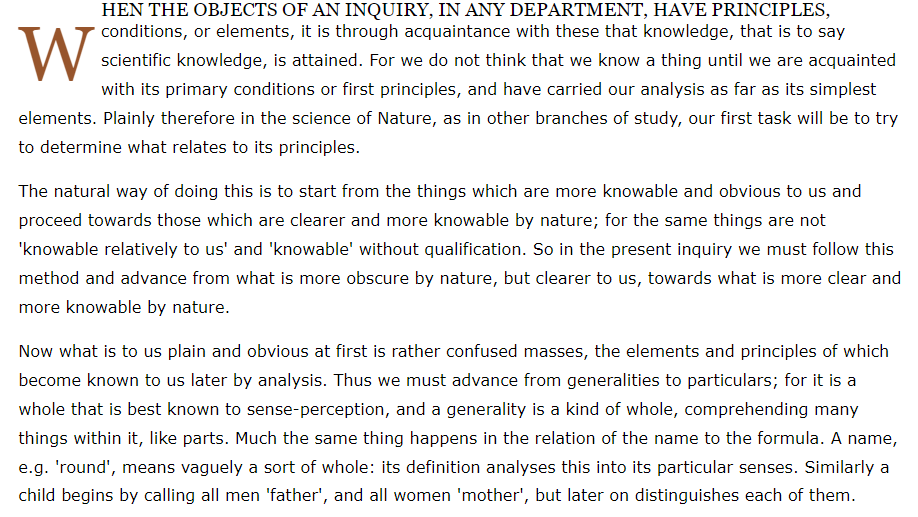
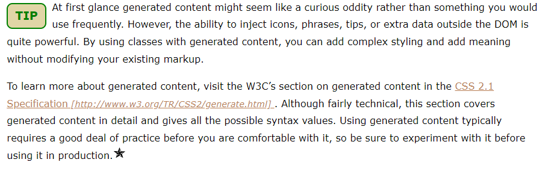

## 01. Child Selectors

The structural pseudo-class selectors :first-child, :last-child, and :only-child match elements when they are the first, last, or only elements within a parent element. It’s important to note that the selector will not return a match if the targeted element is not a literal match within the parent. That is, the selector p:first-child will only return a match if a paragraph appears before any other content within the parent.

### Syntax

As a structural pseudo-class selector, first-child, last-child, and only-child is preceded by a colon (:). To make any of the selectors element specific, you can place a simple selector prior to the colon with no whitespace.

```css
:first-child {
  color: red;
    }

li:first-child {
  color: red;
    }

:last-child {
  color: red;
    }

li:last-child {
  color: red;
    }  

:only-child {
  color: red;
    }

li:only-child {
  color: red;
    }
```

### Example:

The structural pseudo-class child selectors confuse some people, as they expect them to match the first, last, or only instance of a targeted element. What the selectors actually do is match an element only if it’s the first, last, or only child contained within the parent repectively. This paragraph, for example, is neither the first, last, or only child of the section, so it would not return a match.

## 02. Child of Type Selectors

The structural pseudo-class selectors :first-of-type, :last-of-type, and :only-of-type match elements when they are the first, last, or only elements of their type within a parent element. A literal match is not required, they simply need to be the first, last, or only element of that type within a parent. The selector p:first-of-type will match the first paragraph within a parent, regardless of other elements that precede it.

### Syntax

As a structural pseudo-class selector, first-of-type, last-of-type, and only-of-type is preceded by a colon (:). To make any of the selectors element specific, you can place a simple selector prior to the colon with no whitespace.

```css
:first-of-type {
  color: red;
    }

li:first-of-type {
  color: red;
    }

:last-of-type {
  color: red;
    }

li:last-of-type {
  color: red;
    }  

:only-of-type {
  color: red;
    }

li:only-of-type {
  color: red;
    }
```

### Example:



## 03. Targeting Empty Elements

Matches elements that have no children, including other elements or text. Comments are ignored, although any amount of whitespace will negate a match.

### Syntax

As a structural pseudo-class selector, empty is preceded by a colon (:). To make it element specific, you can place a simple selector prior to the colon with no whitespace.

```css
:empty {
  border: 1px solid red;
    }

td:empty {
  border: 1px solid red;
    }
```

### Example:

Below this paragraph is an empty paragraph. It will match :empty or not based on whether it contains whitespace or not.



## 04. Targeting Inline Content

Matches the first letter and first formatted line of content of an element. First letter will match if it’s the first letter of a block of content, and not preceded by another element or other content. First line is not defined by punctuation; rather it’s the result of multiple factors like the width of the element or font-size. In both cases the target element must have a display value of block, inline-block, table-cell, or table-caption to return a match. First line is limited to font properties, color, background, and related text properties for styling purposes. First letter is subject to the same restrictions but also allows margin and padding properties.

### Syntax

As a structural pseudo-class elements, first-letter and first-line is preceded by two colons (::). To make either element specific, you can place a simple selector prior to the colons with no whitespace. The double colon syntax was added to the CSS Selectors Level 3 specfication as a way to distinguish pseudo-element selectors from pseudo-class selectors. Many designers still use the single colon syntax as a way to be backwards compatible with older browsers. There is no penalty for using the older syntax.

```css
::first-letter {
  color: red;
    }

p::first-letter {
  color: red;
    }

::first-line {
  color: red;
    }

p::first-line {
  color: red;
    }
```

### Example:



## 05. Negation Selector

Matches any element that is not represented in the expressed argument. Any simple selector can be passed to the argument, although it cannot accept another negation selector or any of the pseudo-element selectors. It’s easier to understand if you can see how it works:

- :not(p) matches all elements except paragraphs
- p:not([class]) matches all paragraphs except those with a class attribute
- li:not(:last-child) matches all list items except the last one

### Syntax

The negation selector is written as a pseudo-class selector, meaning there is first a colon(:) followed by the word not. After the word not the argument is passed into a set of parentheses. No whitespace is used in any of the elements. Inside the parentheses simple selectors are constructed based on their own syntax rules. To make it element specific, you can place a simple selector prior to the colons with no whitespace.

```css
:not(p) {
  font-size: 2em;
    }

p:not(.large) {
  font-size: 0.8em;
    }
```

### Example:

One of the trickier parts of using the negation selector is anticipating exactly which elements it will match. Since you're eliminating a specific instance of an element from being targeted, it means that all other instances of that element or elements will match. This illustrates why care should be taken when planning its use.

This paragraph has the class "second".

This paragraph has the class "third".

## 06. Generated Content

The ::before and ::after pseudo-class elements allow you to inject content before or after the contents of the targeted elements. You can think of this content as separate inline elements that can be styled independently of the existing element’s content. To generate the content you must use the content property, which can accept strings, url() for images, counter values, and the attribute function attr() which returns the value of a specified attribute as a string value. Since the generated content can be styled independently, it’s also acceptable to use a background-image rather than the url() function.

### Syntax

As a structural pseudo-class elements, before and after is preceded by two colons (::). To make either element specific, you can place a simple selector prior to the colons with no whitespace. Within the rule declaration the content property must be present to generate content. The content property will accept string values in quotations, the url() function, the counter() function for numbering items like lists, and keywords like open-quote and close-quote. The double colon syntax was added to the CSS Selectors Level 3 specfication as a way to distinguish pseudo-element selectors from pseudo-class selectors. Many designers still use the single colon syntax as a way to be backwards compatible with older browsers. There is no penalty for using the older syntax.

```css
p::before {
  content: "hello";
    }

p::after {
  content: "hello";
    }
```

### Example:



## 07. Combining Selectors

Pseudo-class selectors have the ability to be chained together into more complex selectors. When chained, each pseudo-class selector is considered when matching elements, so a:first-child:hover would match only links that are the first child of their parents while hovered. Pseudo-element selectors cannot be chained, but they can be the right-most selector in a chain, meaning p:only-of-type::first-line would be permitted.

### Syntax

To chain pseudo-class selectors, simply add additional pseudo-class selectors to each other without whitespace between them. It is worth noting that IDs and Classes can be chained in this manner as well.

```css
h4:last-child:first-of-type {
  color: red;
    }

a.current:first-child:hover {
  color: red;
    }
```

### Example:

#### PATTERN 1: EXCERPT
When the objects of an inquiry, in any department, have principles, conditions, or elements, it is through acquaintance with these that knowledge, that is to say scientific knowledge, is attained. For we do not think that we know a thing until we are acquainted with its primary conditions or first principles, and have carried our analysis as far as its simplest elements. Plainly therefore in the science of Nature, as in other branches of study, our first task will be to try to determine what relates to its principles.

#### Pattern 2: Spotlight
##### Subject heading
The natural way of doing this is to start from the things which are more knowable and obvious to us and proceed towards those which are clearer and more knowable by nature; for the same things are not 'knowable relatively to us' and 'knowable' without qualification. So in the present inquiry we must follow this method and advance from what is more obscure by nature, but clearer to us, towards what is more clear and more knowable by nature.

#### Pattern 3: Article
When the objects of an inquiry, in any department, have principles, conditions, or elements, it is through acquaintance with these that knowledge, that is to say scientific knowledge, is attained. For we do not think that we know a thing until we are acquainted with its primary conditions or first principles, and have carried our analysis as far as its simplest elements. Plainly therefore in the science of Nature, as in other branches of study, our first task will be to try to determine what relates to its principles.

#### Subhead
The natural way of doing this is to start from the things which are more knowable and obvious to us and proceed towards those which are clearer and more knowable by nature; for the same things are not 'knowable relatively to us' and 'knowable' without qualification. So in the present inquiry we must follow this method and advance from what is more obscure by nature, but clearer to us, towards what is more clear and more knowable by nature.

Now what is to us plain and obvious at first is rather confused masses, the elements and principles of which become known to us later by analysis. Thus we must advance from generalities to particulars; for it is a whole that is best known to sense-perception, and a generality is a kind of whole, comprehending many things within it, like parts. Much the same thing happens in the relation of the name to the formula. A name, e.g. 'round', means vaguely a sort of whole: its definition analyses this into its particular senses. Similarly a child begins by calling all men 'father', and all women 'mother', but later on distinguishes each of them.
