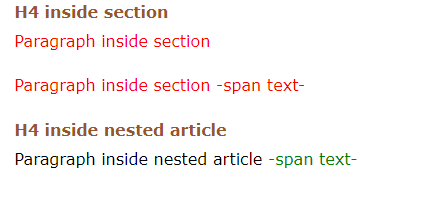
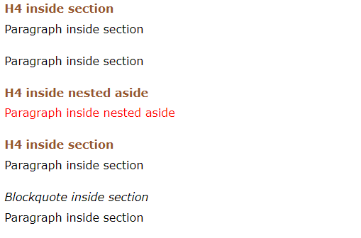
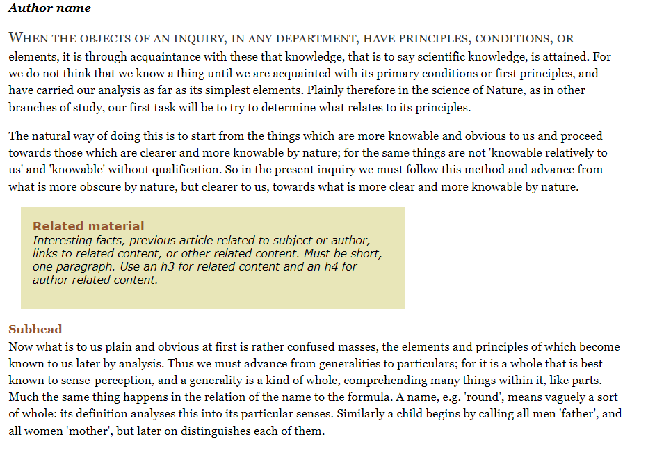

## 01. Child Combinators

Matches elements that are direct children of the specified parent. The child combinator is represented by the “greater-than” sign (>) and is used to separate two simple selectors. The right-most selector is the child target and the left-most selector is the direct parent. Unlike descendent selectors, which target any descendent of a parent no matter how deeply nested, the child combinator only targets the direct children of the parent.

### Syntax

A combination of simple selectors separated by a “greater than” sign (>). Whitespace between selectors and the child combinator is optional, but typical for readability. May be combined with descendent selectors or chained to define multiple levels of parent to child relationships.

```css
article > p {
  color: red;
    }

article > section > h2 {
  color: red;
    }
```

### Example:



## 02. Targeting General Siblings

Matches elements that are siblings of a referenced element. The general sibling combinator is represented by the “tilde” character (~) and is used to separate two simple selectors. The right-most selector is the target element and any other referenced selectors must be siblings within the same parent to return a match.

### Syntax

A combination of simple selectors separated by a “tilde” character (~). Whitespace between selectors and the general sibling combinator is optional, but typical for readability. May be combined with descendent selectors or chained to define multiple siblings.

```css
h1 ~ p {
  color: red;
    }

article h2 ~ blockquote {
  color: red;
    }
```

### Example:



## 03. Targeting Adjacent Siblings

Returns a match only if the targeted element is immediately preceded by the referenced element. The adjacent sibling combinator is represented by the “plus” symbol (+) and is used to separate two simple selectors. The right-most selector is the target element and any other referenced selectors must immediately before the target element with no other content between them.

### Syntax

A combination of simple selectors separated by a “plus” symbol (+). Whitespace between selectors and the adjacent sibling combinator is optional, but typical for readability. May be combined with descendent selectors or chained to define multiple siblings.

```css
h1 + p {
  color: red;
    }

article h1 + h2 {
  color: red;
    }
```

### Example:


