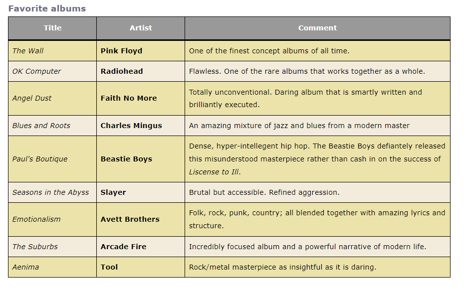
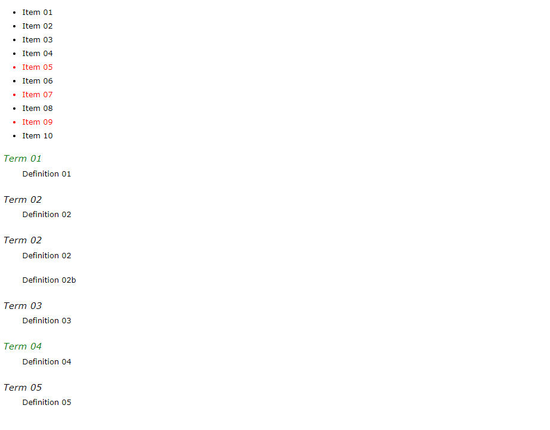
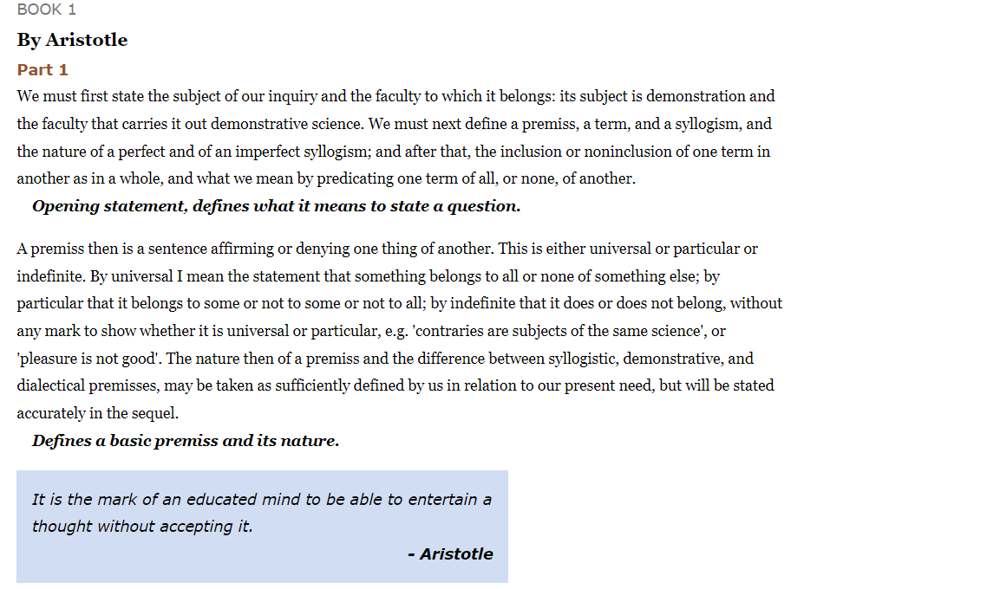
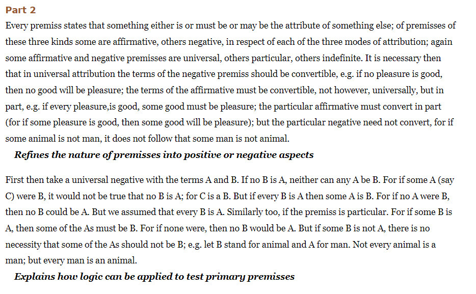
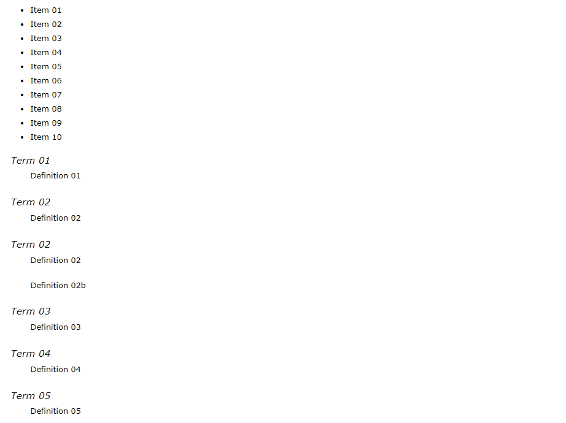

## 01. NTH Child Selectors 1

Matches elements based on keywords or patterns that are passed into the selector as an argument. In it’s simplest form it matches elements based on the even or odd keywords, returning all odd or even numbered targeted elements. If a single value is passed into the selector that specific element is returned if it exists. For example the selector li:nth-child(3) would match the third list item in a list. It gets a little more complicated when you consider the pattern matching formula of (an + b), where a is the number to match, n represents a repeating pattern, and b is a starting offset. The value (3n) would match every third item, starting from the third item and continuing (so 3, 6, 9, and so on). The value (3n + 2) would match every third item, starting with the second item (so 2, 5, 8, and so on). Some values are redundant, (2n + 2) would be the same as (2n), for example. Negative values can be used for both a and b values, and can allow you to count backwards, but a match will be returned only if they result in a positive value. The value (-2n + 10) would start at 10 and count backwards by two, returning the 10th, 8th, 6th, 4th, and 2nd elements.

There are four variations to nth-child selectors; nth-child(n), nth-last-child(n), nth-of-type(n), and nth-last-of-type(n).

### Syntax

As a pseudo-class selector, nth-child selectors start with a colon (:), followed by the appropriate selector (nth-child), which is followed by a parentheses containing either a keyword (even or odd) or a pattern matching formula.

```css
matching single ordinal:
:nth-child(4) {
  color: red;
    }

matching keyword:
:nth-child(odd) {
  color: red;
    }

element specific:
td:nth-child(even) {
  color: red;
    }
```

### Example:



## 02. NTH Child Selectors 2

Matches elements based on keywords or patterns that are passed into the selector as an argument. In it’s simplest form it matches elements based on the even or odd keywords, returning all odd or even numbered targeted elements. If a single value is passed into the selector that specific element is returned if it exists. For example the selector li:nth-child(3) would match the third list item in a list. It gets a little more complicated when you consider the pattern matching formula of (an + b), where a is the number to match, n represents a repeating pattern, and b is a starting offset. The value (3n) would match every third item, starting from the third item and continuing (so 3, 6, 9, and so on). The value (3n + 2) would match every third item, starting with the second item (so 2, 5, 8, and so on). Some values are redundant, (2n + 2) would be the same as (2n), for example. Negative values can be used for both a and b values, and can allow you to count backwards, but a match will be returned only if they result in a positive value. The value (-2n + 10) would start at 10 and count backwards by two, returning the 10th, 8th, 6th, 4th, and 2nd elements.

There are four variations to nth-child selectors; nth-child(n), nth-last-child(n), nth-of-type(n), and nth-last-of-type(n).

### Syntax

As a pseudo-class selector, nth-child selectors start with a colon (:), followed by the appropriate selector (nth-child), which is followed by a parentheses containing either a keyword (even or odd) or a pattern matching formula.

```css
every 2nd item:
:nth-child(2n) {
  color: red;
    }

every 2nd item, starting with item 4:
:nth-child(2n + 4) {
  color: red;
    }
```

### Example:



## 03. NTH Child Selectors 3

Matches elements based on keywords or patterns that are passed into the selector as an argument. In it’s simplest form it matches elements based on the even or odd keywords, returning all odd or even numbered targeted elements. If a single value is passed into the selector that specific element is returned if it exists. For example the selector li:nth-child(3) would match the third list item in a list. It gets a little more complicated when you consider the pattern matching formula of (an + b), where a is the number to match, n represents a repeating pattern, and b is a starting offset. The value (3n) would match every third item, starting from the third item and continuing (so 3, 6, 9, and so on). The value (3n + 2) would match every third item, starting with the second item (so 2, 5, 8, and so on). Some values are redundant, (2n + 2) would be the same as (2n), for example. Negative values can be used for both a and b values, and can allow you to count backwards, but a match will be returned only if they result in a positive value. The value (-2n + 10) would start at 10 and count backwards by two, returning the 10th, 8th, 6th, 4th, and 2nd elements.

There are four variations to nth-child selectors; nth-child(n), nth-last-child(n), nth-of-type(n), and nth-last-of-type(n).

### Syntax

As a pseudo-class selector, nth-child selectors start with a colon (:), followed by the appropriate selector (nth-child), which is followed by a parentheses containing either a keyword (even or odd) or a pattern matching formula.

```css
every 2nd dt element:
dt:nth-of-type(2n) {
  color: red;
    }

every 2nd paragraph, starting with the third:
p:nth-of-type(2n + 3) {
  color: red;
    }
```

### Example:




## 04. NTH Child Selectors 4

Matches elements based on keywords or patterns that are passed into the selector as an argument. In it’s simplest form it matches elements based on the even or odd keywords, returning all odd or even numbered targeted elements. If a single value is passed into the selector that specific element is returned if it exists. For example the selector li:nth-child(3) would match the third list item in a list. It gets a little more complicated when you consider the pattern matching formula of (an + b), where a is the number to match, n represents a repeating pattern, and b is a starting offset. The value (3n) would match every third item, starting from the third item and continuing (so 3, 6, 9, and so on). The value (3n + 2) would match every third item, starting with the second item (so 2, 5, 8, and so on). Some values are redundant, (2n + 2) would be the same as (2n), for example. Negative values can be used for both a and b values, and can allow you to count backwards, but a match will be returned only if they result in a positive value. The value (-2n + 10) would start at 10 and count backwards by two, returning the 10th, 8th, 6th, 4th, and 2nd elements.

There are four variations to nth-child selectors; nth-child(n), nth-last-child(n), nth-of-type(n), and nth-last-of-type(n).

### Syntax

As a pseudo-class selector, nth-child selectors start with a colon (:), followed by the appropriate selector (nth-child), which is followed by a parentheses containing either a keyword (even or odd) or a pattern matching formula.

```css
every 2nd item counting backwards from 10:
:nth-child(-2n + 10) {
  color: red;
    }

matches last five items:
:nth-last-child(-n + 5) {
  color: red;
    }
```

### Example:


