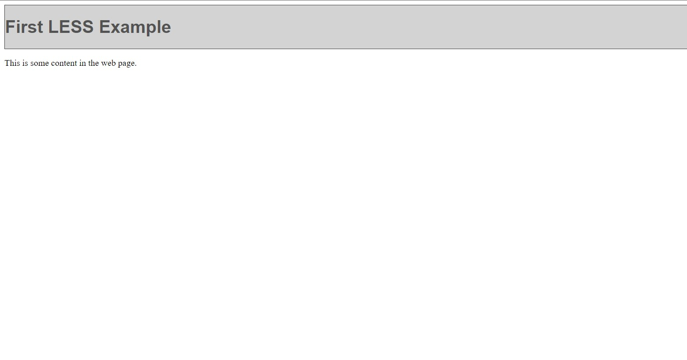

# Less Preprocessor

Less is a dynamic preprocessor style sheet language that can be compiled into Cascading Style Sheets and run on the client side or server side. Designed by Alexis Sellier, Less is influenced by Sass and has influenced the newer "SCSS" syntax of Sass, which adapted its CSS-like block formatting syntax.


## Variable

LESS allows variables to be defined with an @ symbol. The Variable assignment is done with a colon(:). The following table demonstrates the use of LESS variables in detail. Sr.No. Variables usage & Description.

### LESS Code

```css

@baseColor: #535353;

header {
  font-family: Helvetica, Arial, sans-serif;
  background-color: lighten(@baseColor, 50%);
  border: 1px solid darken(@baseColor, 10%);
  color: @baseColor;
}

```


### CSS Code

```css

header {
  font-family: Helvetica, Arial, sans-serif;
  background-color: #d3d3d3;
  border: 1px solid #3a3a3a;
  color: #535353;
}

```


### HTML Code

``` html
<!DOCTYPE html>
<html lang="en">
<head>

    <link rel="stylesheet" href="styles.css" type="text/css" />
    <title>First LESS Example</title>

</head>
<body>
    <div>
        <header>
            <h1>First LESS Example</h1>
        </header>
        <div>
            <p>This is some content in the web page.</p>
        </div>
    </div>
</body>
</html>

```

### Output


