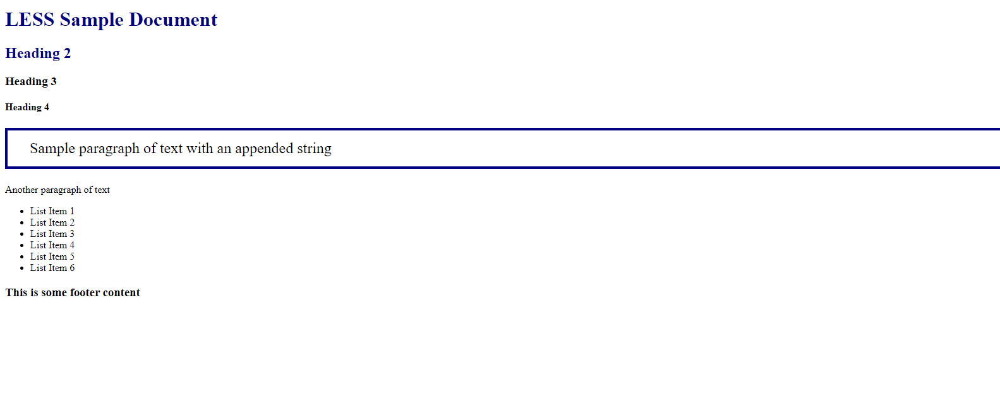
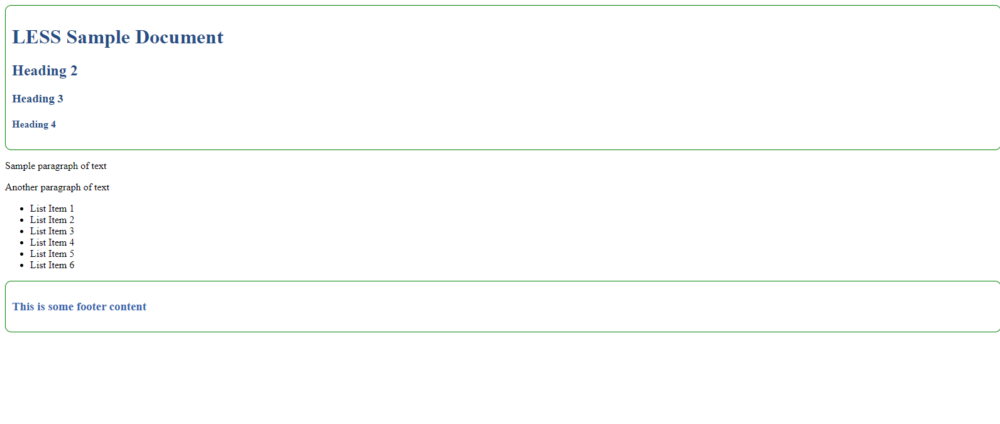
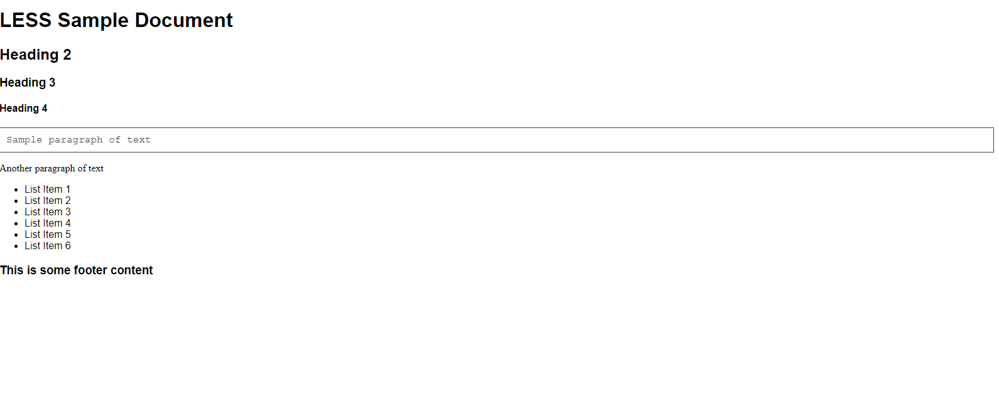
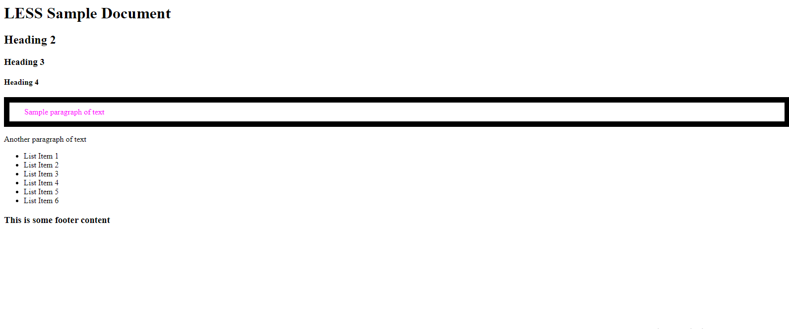
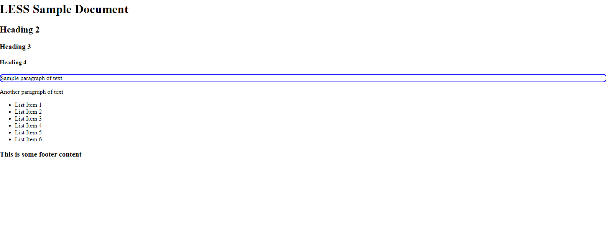
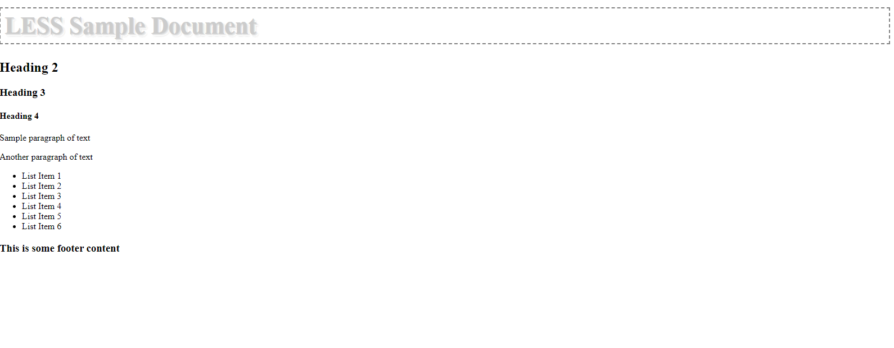
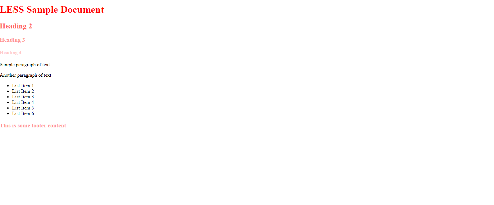
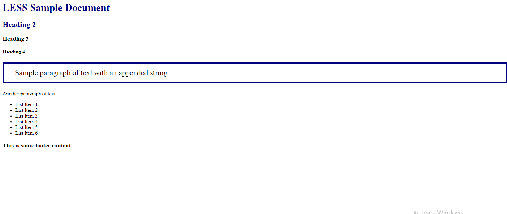

# Less Preprocessor

Less is a dynamic preprocessor style sheet language that can be compiled into Cascading Style Sheets and run on the client side or server side. Designed by Alexis Sellier, Less is influenced by Sass and has influenced the newer "SCSS" syntax of Sass, which adapted its CSS-like block formatting syntax.


## Variable

LESS allows variables to be defined with an @ symbol. The Variable assignment is done with a colon(:). The following table demonstrates the use of LESS variables in detail. Sr.No. Variables usage & Description.

### LESS Code

```css

@baseColor: #535353;

header {
  font-family: Helvetica, Arial, sans-serif;
  background-color: lighten(@baseColor, 50%);
  border: 1px solid darken(@baseColor, 10%);
  color: @baseColor;
}

```


### CSS Code

```css

header {
  font-family: Helvetica, Arial, sans-serif;
  background-color: #d3d3d3;
  border: 1px solid #3a3a3a;
  color: #535353;
}

```


### HTML Code

``` html
<!DOCTYPE html>
<html lang="en">
<head>

    <link rel="stylesheet" href="styles.css" type="text/css" />
    <title>First LESS Example</title>

</head>
<body>
    <div>
        <header>
            <h1>First LESS Example</h1>
        </header>
        <div>
            <p>This is some content in the web page.</p>
        </div>
    </div>
</body>
</html>

```

### Output


## Advanced Variable

LESS allows variables to be defined with an @ symbol. The Variable assignment is done with a colon(:). The following table demonstrates the use of LESS variables in detail. Sr.No. Variables usage & Description.

### LESS Code

```css
/*
 * LESS Variables are defined with an @ character
 * and can have different kinds of data types:
 *  color, string, boolean, multi-value
 */

@myColor1: navy;                            // named color value
@myColor2: #000080;                         // hex color value
@myStringVar: " with an appended string";   // string variable
@myFontSize: 24px;                          // numeric value
@thinBorder: 4px solid @myColor1;           // multi-value variable
@paddingVar: 15px 15px 15px 35px;           // multi-value variable

h1, h2 {
    color: @myColor1;
}

#mypara {
    font-size: @myFontSize;
    border: @thinBorder;
    padding: @paddingVar;
}

#mypara:after {
    content: @myStringVar;
}

```

### CSS Code

```css
/*
 * LESS Variables are defined with an @ character
 * and can have different kinds of data types:
 *  color, string, boolean, multi-value
 */
h1,
h2 {
  color: #000080;
}
#mypara {
  font-size: 24px;
  border: 4px solid #000080;
  padding: 15px 15px 15px 35px;
}
#mypara:after {
  content: " with an appended string";
}
```

### HTML Code

``` html
<!DOCTYPE html>
<html lang="en">
    <head>
        <title>LESS Sample Document</title>
        <link rel="stylesheet" href="" type="text/css">

        <link rel="stylesheet" href="var_styles.css" type="text/css">


    </head>

    <body>
        <div id="pagecontent">
            <header>
                <h1>LESS Sample Document</h1>
                <h2>Heading 2</h2>
                <h3>Heading 3</h3>
                <h4>Heading 4</h4>
            </header>
            <div>
                <p id="mypara">Sample paragraph of text</p>
                <p>Another paragraph of text</p>
            </div>
            <div>
                <ul id="list1">
                <li>List Item 1</li>
                <li>List Item 2</li>
                <li>List Item 3</li>
                <li>List Item 4</li>
                <li>List Item 5</li>
                <li>List Item 6</li>
                </ul>
            </div>
            <footer>
                <h3>This is some footer content</h3>
            </footer>
        </div>
    </body>
</html>
```

### Output



## Mixins

Mixins are similar to functions in programming languages. Mixins are a group of CSS properties that allow you to use properties of one class for another class and includes class name as its properties. In LESS, you can declare a mixin in the same way as CSS style using class or id selector. It can store multiple values and can be reused in the code whenever necessary.

The following table demonstrates the use of LESS mixins in detail.

### LESS Code

```css
/*
 * LESS mixins are declared like any other CSS class
 * and used by including the class name where you want it
 */

.commonTraits {
    border-radius: 10px;
    border: 1px solid green;
    padding: 10px;
}

header{

color:#274D87;
.commonTraits;

}

footer{
color:#3264AF;
.commonTraits;
}
```

### CSS Code

```css
/*
 * LESS mixins are declared like any other CSS class
 * and used by including the class name where you want it
 */
.commonTraits {
  border-radius: 10px;
  border: 1px solid green;
  padding: 10px;
}
header {
  color: #274D87;
  border-radius: 10px;
  border: 1px solid green;
  padding: 10px;
}
footer {
  color: #3264AF;
  border-radius: 10px;
  border: 1px solid green;
  padding: 10px;
}
```

### HTML Code

``` html
<!DOCTYPE html>
<html lang="en">
    <head>
        <title>LESS Sample Document</title>
        <link rel="stylesheet" href="" type="text/css">

        <link rel="stylesheet" href="mixin_styles.css" type="text/css">


    </head>

    <body>
        <div id="pagecontent">
            <header>
                <h1>LESS Sample Document</h1>
                <h2>Heading 2</h2>
                <h3>Heading 3</h3>
                <h4>Heading 4</h4>
            </header>
            <div>
                <p id="mypara">Sample paragraph of text</p>
                <p>Another paragraph of text</p>
            </div>
            <div>
                <ul id="list1">
                <li>List Item 1</li>
                <li>List Item 2</li>
                <li>List Item 3</li>
                <li>List Item 4</li>
                <li>List Item 5</li>
                <li>List Item 6</li>
                </ul>
            </div>
            <footer>
                <h3>This is some footer content</h3>
            </footer>
        </div>
    </body>
</html>
```

### Output




## Nested Selector

It is a group of CSS properties which allows using properties of one class into another class and includes the class name as its properties. In LESS, you can declare mixin in the same way as CSS style using class or id selector. It can store multiple values and can be reused in the code whenever necessary.

### LESS Code

```css
/*
 * LESS allows style rules to be nested inside of other rules, which causes
 * the nested rules to only apply within the outer rule's selector
 */
body {
    font-family: Helvetica, Arial, sans-serif;

    p {
        font-family:Times;
    }
    p#mypara {
        font-family: "Courier New";
    }
}

#mypara {
    color: #404040;
    border: 1px solid #404040;
    padding: 10px;

    &:hover {/*& is the parent element*/
        color: red;
    }
}
```

### CSS Code

```css
/*
 * LESS allows style rules to be nested inside of other rules, which causes
 * the nested rules to only apply within the outer rule's selector
 */
body {
  font-family: Helvetica, Arial, sans-serif;
}
body p {
  font-family: Times;
}
body p#mypara {
  font-family: "Courier New";
}
#mypara {
  color: #404040;
  border: 1px solid #404040;
  padding: 10px;
}
#mypara:hover {
  /*& is the parent element*/
  color: red;
}
```

### HTML Code

``` html
<!DOCTYPE html>
<html lang="en">
    <head>
        <title>LESS Sample Document</title>
        <link rel="stylesheet" href="" type="text/css">

        <link rel="stylesheet" href="nested_styles.css" type="text/css">


    </head>

    <body>
        <div id="pagecontent">
            <header>
                <h1>LESS Sample Document</h1>
                <h2>Heading 2</h2>
                <h3>Heading 3</h3>
                <h4>Heading 4</h4>
            </header>
            <div>
                <p id="mypara">Sample paragraph of text</p>
                <p>Another paragraph of text</p>
            </div>
            <div>
                <ul id="list1">
                <li>List Item 1</li>
                <li>List Item 2</li>
                <li>List Item 3</li>
                <li>List Item 4</li>
                <li>List Item 5</li>
                <li>List Item 6</li>
                </ul>
            </div>
            <footer>
                <h3>This is some footer content</h3>
            </footer>
        </div>
    </body>
</html>
```

### Output




## Operators

LESS provides support for some arithmetical operations such as plus (+), minus (-), multiplication (*) and division (/) and they can operate on any number, color or variable. Operations save lot of time when you are using variables and you feel like working on simple mathematics.

### LESS Code

```css
/*
 * LESS Operators example
 *
 * Operators let you perform mathematical functions inside of CSS styles
 */

@color: #f00;
@basepadding: 10px;
@basethickness: 1px;

#mypara {
    color: @color + #00F;
    border: (@basethickness + 21)/2 solid black;
    padding: @basepadding @basepadding+20;
}
```

### CSS Code

```css
/*
 * LESS Operators example
 *
 * Operators let you perform mathematical functions inside of CSS styles
 */
#mypara {
  color: #ff00ff;
  border: 11px solid #000000;
  padding: 10px 30px;
}
```

### HTML Code

``` html
<!DOCTYPE html>
<html lang="en">
    <head>
        <title>LESS Sample Document</title>
        <link rel="stylesheet" href="" type="text/css">

        <link rel="stylesheet" href="ops_styles.css" type="text/css">


    </head>

    <body>
        <div id="pagecontent">
            <header>
                <h1>LESS Sample Document</h1>
                <h2>Heading 2</h2>
                <h3>Heading 3</h3>
                <h4>Heading 4</h4>
            </header>
            <div>
                <p id="mypara">Sample paragraph of text</p>
                <p>Another paragraph of text</p>
            </div>
            <div>
                <ul id="list1">
                <li>List Item 1</li>
                <li>List Item 2</li>
                <li>List Item 3</li>
                <li>List Item 4</li>
                <li>List Item 5</li>
                <li>List Item 6</li>
                </ul>
            </div>
            <footer>
                <h3>This is some footer content</h3>
            </footer>
        </div>
    </body>
</html>
```

### Output




## Mixins Params

Detached ruleset contains rulesets such as properties, nested rulesets, variables declaration, mixins, etc. It is stored in a variable and included in another structure; all the properties of the ruleset get copied to that structure.

### LESS Code

```css
/*
 * Using LESS mixins with arguments
 */

.border-radius(@radius: 5px) {
    -mox-border-radius: @radius;
    -webkit-border-radius: @radius;
    -ms-border-radius: @radius;
    border-radius: @radius;
}

.customBorder(@color: black, @width: 1px) {
    border: @width solid @color;
}

.box-shadow(@x: 0, @y: 0, @blur:1px, @color: #000) {
    -webkit-box-shadow: @arguments;
    -mox-box-shadow: @arguments;
    -ms-box-shadow: @arguments;
    box-shadow: @arguments;
}

#mypara{
.border-radius(10px);
 .customBorder(blue,2px);
 .box-shadow(10px,10px,15,red);
}
```

### CSS Code

```css
/*
 * Using LESS mixins with arguments
 */
#mypara {
  -mox-border-radius: 10px;
  -webkit-border-radius: 10px;
  -ms-border-radius: 10px;
  border-radius: 10px;
  border: 2px solid #0000ff;
  -webkit-box-shadow: 10px 10px 15 #ff0000;
  -mox-box-shadow: 10px 10px 15 #ff0000;
  -ms-box-shadow: 10px 10px 15 #ff0000;
  box-shadow: 10px 10px 15 #ff0000;
}
```

### HTML Code

``` html
<!DOCTYPE html>
<html lang="en">
    <head>
        <title>LESS Sample Document</title>
        <link rel="stylesheet" href="mixargs_styles.css" type="text/css">
    </head>

    <body>
        <div id="pagecontent">
            <header>
                <h1>LESS Sample Document</h1>
                <h2>Heading 2</h2>
                <h3>Heading 3</h3>
                <h4>Heading 4</h4>
            </header>
            <div>
                <p id="mypara">
                    Sample paragraph of text
                </p>
                <p>
                    Another paragraph of text
                </p>
            </div>
            <div>
                <ul id="list1">
                    <li>List Item 1</li>
                    <li>List Item 2</li>
                    <li>List Item 3</li>
                    <li>List Item 4</li>
                    <li>List Item 5</li>
                    <li>List Item 6</li>
                </ul>
            </div>
            <footer>
                <h3>This is some footer content</h3>
            </footer>
        </div>
    </body>
</html>
```

### Output




## Mixins Gurds

If you want to match simple values or number of arguments on expressions, then you can make use of guards. It is associated with mixin declaration and includes condition that is attached to a mixin. Each mixin will have one or more guards which are separated by comma; a guard must be enclosed within parentheses. LESS uses guarded mixins instead of if/else statements and performs calculations to specify matched mixin.

### LESS Code

```css
/*
 * Using LESS pattern matching and guarded mixins
 *
 */


 .text3d(@color) when (lightness(@color) =< 50%) {

  color: @color;
    font-size: 32pt;
    border: 2px solid gray;
    text-shadow: 1px 1px 0px darken(@color, 5%),
                2px 2px 0px darken(@color, 10%),
                3px 3px 0px darken(@color, 15%),
                4px 4px 0px darken(@color, 20%),
                4px 4px 3px #000;

 }


 .text3d(@color) when (lightness(@color) > 50%) {
    color: @color;
    font-size: 32pt;
    border: 2px dashed gray;
    text-shadow: 1px 1px 0px lighten(@color, 5%),
                2px 2px 0px lighten(@color, 10%),
                3px 3px 0px lighten(@color, 15%),
                4px 4px 0px lighten(@color, 20%),
                4px 4px 3px #ccc;
}

.text3d(@_){
    font-size: 32pt;
    padding: 5pt;
}

h1{
    .text3d(#ccc);
}
```

### CSS Code

```css
/*
 * Using LESS pattern matching and guarded mixins
 *
 */
h1 {
  color: #cccccc;
  border: 2px dashed gray;
  text-shadow: 1px 1px 0px #d9d9d9, 2px 2px 0px #e6e6e6, 3px 3px 0px #f2f2f2, 4px 4px 0px #ffffff, 4px 4px 3px #cccccc;
  font-size: 32pt;
  padding: 5pt;
}
```

### HTML Code

``` html
<!DOCTYPE html>
<html lang="en">
    <head>
        <title>LESS Sample Document</title>
        <link rel="stylesheet" href="mixguards_styles.css" type="text/css">
    </head>

    <body>
        <div id="pagecontent">
            <header>
                <h1>LESS Sample Document</h1>
                <h2>Heading 2</h2>
                <h3>Heading 3</h3>
                <h4>Heading 4</h4>
            </header>
            <div>
                <p id="mypara">
                    Sample paragraph of text
                </p>
                <p>
                    Another paragraph of text
                </p>
            </div>
            <div>
                <ul id="list1">
                    <li>List Item 1</li>
                    <li>List Item 2</li>
                    <li>List Item 3</li>
                    <li>List Item 4</li>
                    <li>List Item 5</li>
                    <li>List Item 6</li>
                </ul>
            </div>
            <footer>
                <h3>This is some footer content</h3>
            </footer>
        </div>
    </body>
</html>
```

### Output




## Functions

LESS maps JavaScript code with manipulation of values and uses predefined functions to manipulate HTML elements aspects in the style sheet. It provides several functions to manipulate colors such as round function, floor function, ceil function, percentage function etc.

### LESS Code

```css
/*
 * Using LESS functions
 *
 */


@color: red;
h1 {
    color: @color;
}
h2 {
    color: lighten(@color, 20%);
}
h3 {
    color: lighten(@color, 30%);
}
h4 {
    color: lighten(@color, 40%);
}
```

### CSS Code

```css
/*
 * Using LESS functions
 *
 */
h1 {
  color: #ff0000;
}
h2 {
  color: #ff6666;
}
h3 {
  color: #ff9999;
}
h4 {
  color: #ffcccc;
}
```

### HTML Code

``` html
<!DOCTYPE html>
<html lang="en">
    <head>
        <title>LESS Sample Document</title>
        <link rel="stylesheet" href="funcs_styles.css" type="text/css">
    </head>

    <body>
        <div id="pagecontent">
            <header>
                <h1>LESS Sample Document</h1>
                <h2>Heading 2</h2>
                <h3>Heading 3</h3>
                <h4>Heading 4</h4>
            </header>
            <div>
                <p id="mypara">
                    Sample paragraph of text
                </p>
                <p>
                    Another paragraph of text
                </p>
            </div>
            <div>
                <ul id="list1">
                    <li>List Item 1</li>
                    <li>List Item 2</li>
                    <li>List Item 3</li>
                    <li>List Item 4</li>
                    <li>List Item 5</li>
                    <li>List Item 6</li>
                </ul>
            </div>
            <footer>
                <h3>This is some footer content</h3>
            </footer>
        </div>
    </body>
</html>
```

### Output




## Importing

It is used to import the contents of the LESS or CSS files.

### LESS Code

```css
/*
 * This is a LESS file that contains variable definitions that can be imported
 * into another style sheet using the @import directive
 */

@myColor1: navy;                            // named color value
@myColor2: #000080;                         // hex color value
@myStringVar: " with an appended string";   // string variable
@myFontSize: 24px;                          // numeric value
@thinBorder: 4px solid @myColor1;           // multi-value variable
@paddingVar: 15px 15px 15px 35px;           // multi-value variable

```
```css
/*
 * LESS Variables are defined with an @ character
 * and can have different kinds of data types: color, string, boolean, multi-value
 */

// import the definitions used in this file
@import "import_me.less";

h1, h2 {
    color: @myColor1;
}

#mypara {
    font-size: @myFontSize;
    border: @thinBorder;
    padding: @paddingVar;
}

#mypara:after {
    content: @myStringVar;
}
```
### CSS Code

```css
/*
 * This is a LESS file that contains variable definitions that can be imported
 * into another s/*
 * LESS Variables are defined with an @ character
 * and can have different kinds of data types: color, string, boolean, multi-value
 */
/*
 * This is a LESS file that contains variable definitions that can be imported
 * into another style sheet using the @import directive
 */
h1,
h2 {
  color: #000080;
}
#mypara {
  font-size: 24px;
  border: 4px solid #000080;
  padding: 15px 15px 15px 35px;
}
#mypara:after {
  content: " with an appended string";
}tyle sheet using the @import directive
 */
```

### HTML Code

``` html
<!DOCTYPE html>
<html lang="en">
    <head>
        <title>LESS Sample Document</title>
        <link rel="stylesheet" href="import_styles.css" type="text/css">
    </head>

    <body>
        <div id="pagecontent">
            <header>
                <h1>LESS Sample Document</h1>
                <h2>Heading 2</h2>
                <h3>Heading 3</h3>
                <h4>Heading 4</h4>
            </header>
            <div>
                <p id="mypara">
                    Sample paragraph of text
                </p>
                <p>
                    Another paragraph of text
                </p>
            </div>
            <div>
                <ul id="list1">
                    <li>List Item 1</li>
                    <li>List Item 2</li>
                    <li>List Item 3</li>
                    <li>List Item 4</li>
                    <li>List Item 5</li>
                    <li>List Item 6</li>
                </ul>
            </div>
            <footer>
                <h3>This is some footer content</h3>
            </footer>
        </div>
    </body>
</html>
```

### Output


